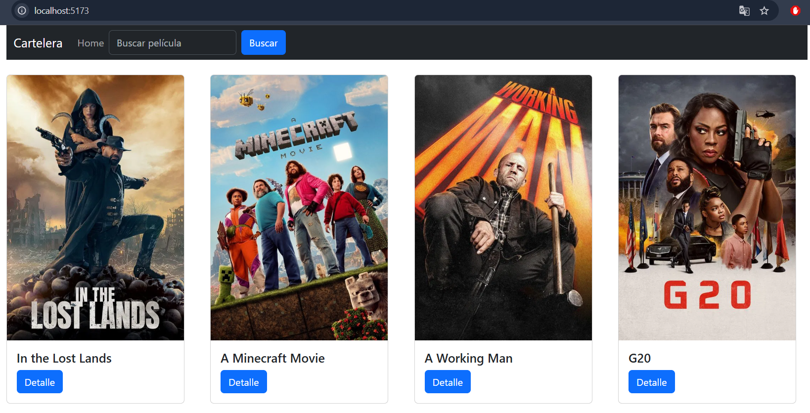
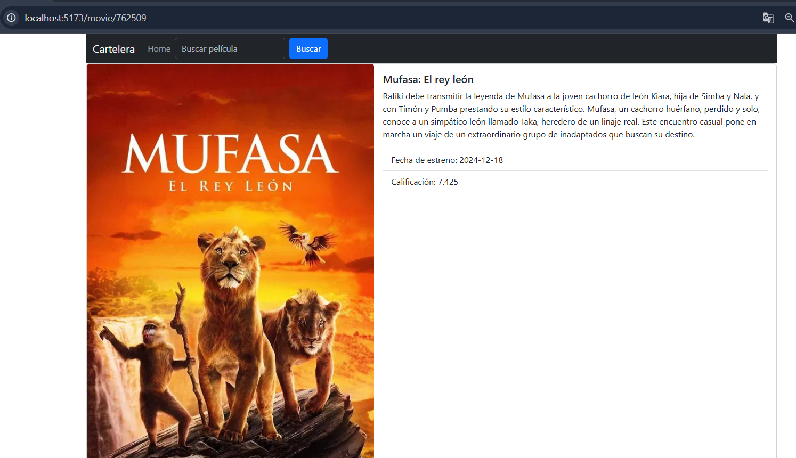
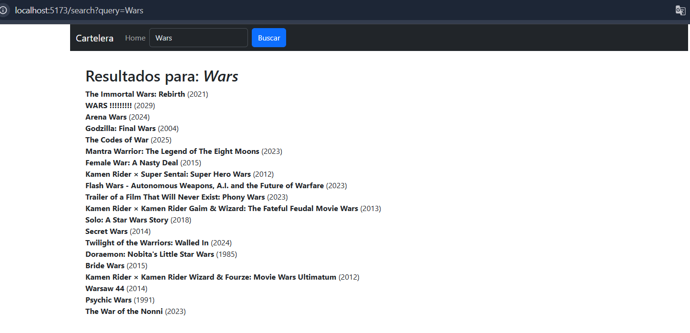

# React + Vite

This template provides a minimal setup to get React working in Vite with HMR and some ESLint rules.

Currently, two official plugins are available:

- [@vitejs/plugin-react](https://github.com/vitejs/vite-plugin-react/blob/main/packages/plugin-react/README.md) uses [Babel](https://babeljs.io/) for Fast Refresh
- [@vitejs/plugin-react-swc](https://github.com/vitejs/vite-plugin-react-swc) uses [SWC](https://swc.rs/) for Fast Refresh


<h2>La ejecución de la app se hace por medio de:</h2>

```bash
npm run dev

> tucine@0.0.0 dev
> vite


  VITE v6.3.0  ready in 431 ms

  ➜  Local:   http://localhost:5173/
  ➜  Network: use --host to expose
  ➜  press h + enter to show help

```

Se le ha de configurar un .env, se adjunta uno de ejemplo.

Este proyecto de TuCine cuenta con tres apartados:


<h2>Home</h2>
</br> Se muestra una lista de las películas más populares en el momento.


</br>
<h2>Detail</h2>
</br> Se muestra más información de la película selccionada.


</br>
<h2>Search</h2>
</br> Como se puede ver en la cabecera de la web, es posible introducir un texto el cual nos presentará 
una lista de películas que coincidan con dicha cadena.

</br>

